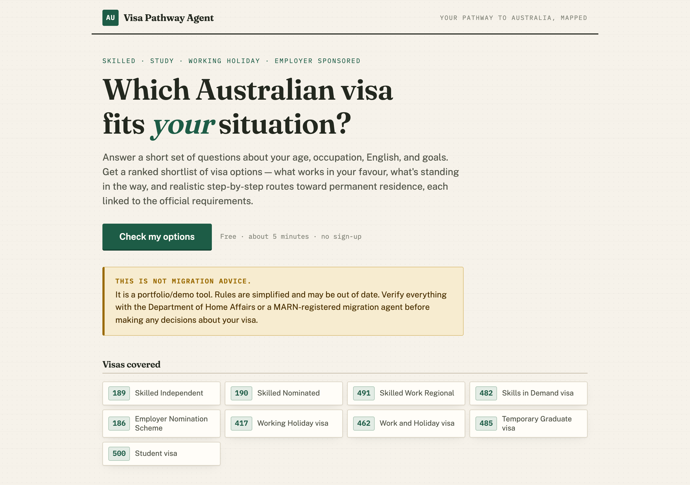
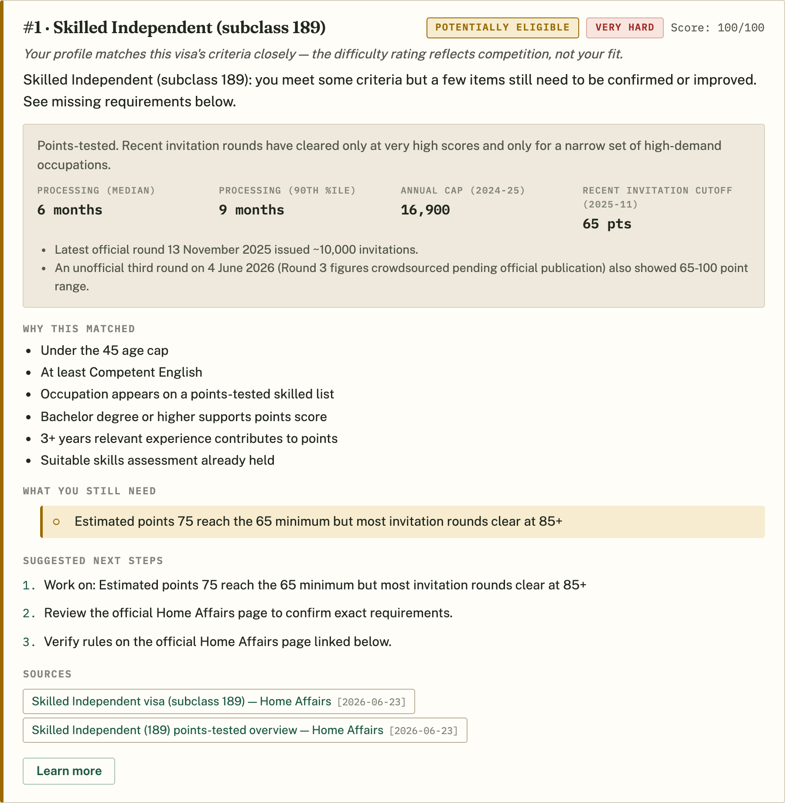

# AU Visa Pathway Agent

A locally runnable Next.js + TypeScript MVP that takes structured answers about a person's situation and returns ranked Australian visa verdicts with rule-based reasons, source links, and multi-step pathway sketches toward permanent residence. The point of the MVP is to demonstrate that visa recommendations come out cleaner when they sit on top of a hand-encoded rules dataset and a pathway graph, rather than a freeform chatbot.



## Scope

The MVP reasons about nine visa subclasses:

- 189 Skilled Independent
- 190 Skilled Nominated
- 491 Skilled Work Regional (Provisional)
- 482 Skills in Demand
- 186 Employer Nomination Scheme
- 417 Working Holiday
- 462 Work and Holiday
- 485 Temporary Graduate
- 500 Student

### What it is

- Rule-based and deterministic — every verdict and pathway comes from code in `src/rules/` and `src/lib/pathways/`.
- Local-only — no external API keys, no database, no hosted service.
- Source-linked — every rule cites a Home Affairs page with a "last checked" date.
- Grounded in program reality — verdict cards carry quantitative context (processing times, annual caps, recent invitation-round cutoffs) so a "you qualify on paper" result is never presented as "you will be invited".
- Curated documents — a small local keyword search over text files under `data/docs/` provides supporting context only.

### What it is not

- Not an LLM-driven product. There is no model call anywhere in scoring or explanation.
- Not a vector database or embeddings pipeline. The local doc search is plain keyword matching.
- Not deployed. There is no production environment, no auth, no analytics.
- Not migration advice. It does not represent a registered migration agent.
- Not a complete encoding of Australian migration law. Rule checks, country lists, and points logic are simplified for portfolio use.

## Quickstart

Requires Node 18+.

```
npm install
npm run dev       # localhost:3000
npm test          # vitest unit tests
npm run eval      # scripted evals; exits non-zero on failure
npm run personas  # 20 realistic profiles + anomaly checks + source-link probe
npm run build     # production build
```

## Architecture overview

- The wizard collects structured inputs for nationality, age, location, current visa, occupation, English, qualification, experience, sponsorship/nomination, regional willingness, study intent, funds, and goal — plus three optional enrichment fields: skills-assessment status, partner situation (affects the points estimate), and expected salary band (checked against the 482 Core Skills Income Threshold).
- `validateSituation` checks types and ranges and surfaces field-level errors. Unknown occupations resolve to "unknown" rather than being silently rejected.
- `checkEligibility` runs every subclass's pure evaluator against the situation, applies a goal-based ranking boost, and returns nine verdicts sorted strongest fit first. Hard blockers cap the score so a blocked subclass never outranks a feasible one, and a points-competitiveness dampener keeps a marginal 189 profile from outranking realistic sponsored or regional options.
- `findPathways` walks a hand-encoded directed pathway graph (e.g. 500 -> 485 -> 482 -> 186, 417 -> 482 -> 186) and returns plausible multi-step routes toward the user's goal. Entry visas the user is hard-blocked from (wrong nationality, over an age cap) are never proposed.
- A simple BM25-style keyword search over `data/docs/` returns supporting snippets with source links in "learn more" panels. It never decides eligibility.



## Data

- `data/occupations.json` — ~1,100 ANZSCO-derived occupations tagged with skilled-list membership (MLTSSL / STSOL / ROL / CSOL). Each rule checks the lists that actually apply to its subclass (189 requires MLTSSL; 482/186 use CSOL; 190/491 accept the state-nomination lists).
- `data/visa-context.json` — quantitative program context per subclass: processing times, annual caps, and recent SkillSelect invitation-round cutoffs, with sources and a last-checked date. Missing fields are hidden in the UI rather than faked.
- `data/docs/` — curated explainer corpus (points test, English equivalence, regional definitions, employer sponsorship, common real-world PR routes), each with title, source URL, and last-checked metadata.
- `data/eval/fixtures.json` — eval scenarios with expected verdicts, rankings, and pathway presence.

## Repo layout

```
.
|-- data/
|   |-- docs/             # curated explainer text files with source metadata
|   |-- eval/             # eval fixtures (fixtures.json)
|   |-- occupations.json  # ANZSCO occupations with skilled-list tags
|   `-- visa-context.json # caps, cutoffs, processing times
|-- docs/                 # README screenshots
|-- scripts/
|   |-- eval.ts           # `npm run eval` entry point
|   `-- personas.ts       # `npm run personas` realism harness
|-- src/
|   |-- app/              # Next.js app router (landing, wizard, results)
|   |-- components/       # wizard, result cards, pathway timeline
|   |-- lib/
|   |   |-- validation/   # validateSituation
|   |   |-- eligibility/  # checkEligibility
|   |   |-- pathways/     # findPathways + pathway graph edges
|   |   `-- search/       # local keyword search over data/docs
|   |-- rules/            # one TS module per supported subclass
|   `-- types/            # shared TypeScript types
|-- tests/                # vitest unit tests
|-- MVP_REQUIREMENTS.md
|-- PLAN.md
|-- package.json
`-- README.md
```

## Tests and evals

Three layers of verification:

- `npm test` — unit tests for validation, rules, eligibility ranking, pathway traversal, and doc search.
- `npm run eval` — reads `data/eval/fixtures.json`, runs each scenario through `checkEligibility` and `findPathways`, checks the declared expectations, and prints a per-fixture pass/fail summary plus per-subclass coverage. Exits non-zero on failure, so it is safe to wire into CI. Fixtures cover all nine subclasses plus edge cases: ages just over a cap, an STSOL-only occupation that must block 189 but not 190, PR goal with no sponsor or nomination, working-holiday nationality mismatches, and goal-alignment ranking checks.
- `npm run personas` — runs 20 realistic applicant profiles (backpackers, sponsored workers, graduates, over-45s, nominated applicants) through the full engine and flags anomalies: status/score contradictions, blocked visas proposed as pathway entries, difficulty/status mismatches, empty next steps, and dead source URLs (every unique Home Affairs link is HEAD-checked).

## Limitations

- Skilled-list membership per occupation is hand-tagged from public sources and simplified; the real lists change with legislative instruments.
- Working Holiday partner country lists (417 and 462) are abbreviated subsets.
- Points logic is approximated (age, English, qualification, experience, study, partner); the real points test is more granular.
- "Last checked" dates on sources reflect when the rules were hand-encoded. The app does not poll Home Affairs for changes.
- Pathway timeframes are indicative ranges, not commitments.
- Some subclasses have multiple streams with distinct rules (e.g. 482 Core/Specialist/Essential, 186 Direct Entry/TRT). The MVP collapses these.

## Disclaimer

This project is a portfolio/demo tool. It is **not migration advice** and it is not produced by a registered migration agent. Outputs are informational sketches based on simplified rules. Verify everything with the official source — [Department of Home Affairs](https://immi.homeaffairs.gov.au/) — and consult a [MARN-registered migration agent](https://www.mara.gov.au/) before making decisions that affect your immigration status.

## Sources

Rules are encoded from publicly available Home Affairs pages under [immi.homeaffairs.gov.au](https://immi.homeaffairs.gov.au/). Each subclass record in `src/rules/` carries its own source URL list with a `lastChecked` date, and `data/visa-context.json` documents where the quantitative context comes from.
